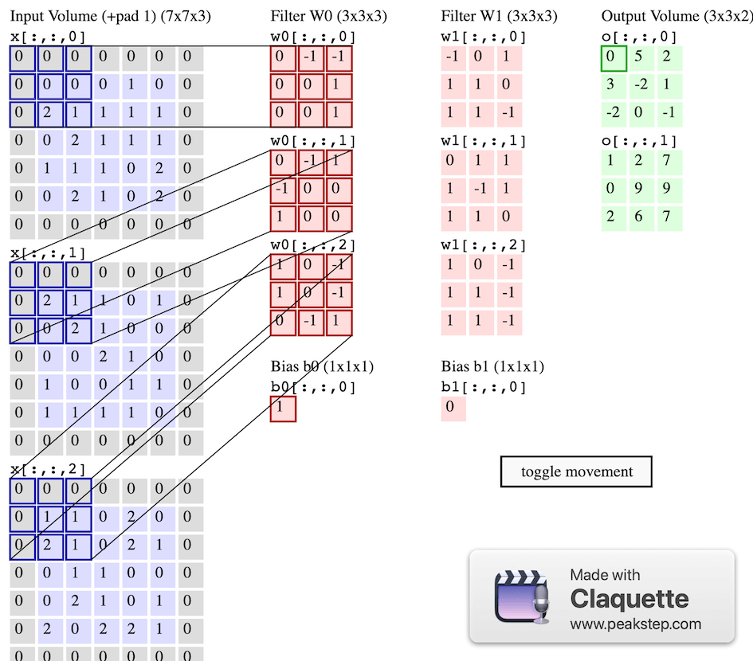

# Some sources

Sources:

 [A Comprehensive Guide to Convolutional Neural Networks — the ELI5 way | by Sumit Saha | Towards Data Science](https://towardsdatascience.com/a-comprehensive-guide-to-convolutional-neural-networks-the-eli5-way-3bd2b1164a53) 

 [vdumoulin/conv_arithmetic: A technical report on convolution arithmetic in the context of deep learning](https://github.com/vdumoulin/conv_arithmetic) 

 [Convolutional neural network - Wikipedia](https://en.wikipedia.org/wiki/Convolutional_neural_network) 

 [Convolution - Wikipedia](https://en.wikipedia.org/wiki/Convolution) 

 [CS231n Convolutional Neural Networks for Visual Recognition](https://cs231n.github.io/convolutional-networks/) 

 [Convolutional Neural Networks, Explained | by Mayank Mishra | Towards Data Science](https://towardsdatascience.com/convolutional-neural-networks-explained-9cc5188c4939) 

 [An Intuitive Explanation of Convolutional Neural Networks – the data science blog](https://ujjwalkarn.me/2016/08/11/intuitive-explanation-convnets/) 

 [Machine Learning is Fun! Part 3: Deep Learning and Convolutional Neural Networks | by Adam Geitgey | Medium](https://medium.com/@ageitgey/machine-learning-is-fun-part-3-deep-learning-and-convolutional-neural-networks-f40359318721) 

# Overview

CNNs use relatively little pre-processing compared to other [image classification algorithms](https://en.wikipedia.org/wiki/Image_classification). This means that the network learns to optimize the [filters](https://en.wikipedia.org/wiki/Filter_(signal_processing)) (or kernels) through automated learning, whereas in traditional algorithms these filters are [hand-engineered](https://en.wikipedia.org/wiki/Feature_engineering). This independence from prior knowledge and human intervention in feature extraction is a major advantage.

The name "convolutional neural network" indicates that the network employs a mathematical operation called [convolution](https://en.wikipedia.org/wiki/Convolution). Convolutional networks are a specialized type of neural networks that use convolution in place of general matrix multiplication in at least one of their layers.

Here is an inline note. ^[Inlines notes are easier to write, since you don't have to pick an identifier and move down to type the note.]

# Convolution and Cross-correlation

In [mathematics](https://en.wikipedia.org/wiki/Mathematics) (in particular, [functional analysis](https://en.wikipedia.org/wiki/Functional_analysis)), **convolution** is a [mathematical operation](https://en.wikipedia.org/wiki/Operation_(mathematics)) on two [functions](https://en.wikipedia.org/wiki/Function_(mathematics)) ($f \ and \ g$) that produces a third function $(f * g)$ that expresses how the shape of one is modified by the other. The term covolution refers to both the result function and to the process of computing it. It is defined as the [integral](https://en.wikipedia.org/wiki/Integral) of the product of the two functions after one is reversed and shifted. The integral is evaluated for all values of shift, producing the convolution function. Some features of convolution are similar to [cross-correlation](https://en.wikipedia.org/wiki/Cross-correlation).

Cross-correlation

In [signal processing](https://en.wikipedia.org/wiki/Signal_processing), **cross-correlation** is a [measure of similarity](https://en.wikipedia.org/wiki/Similarity_measure) of two series as a function of the displacement of one relative to the other. This is also known as a *sliding [dot product](https://en.wikipedia.org/wiki/Dot_product)* or *sliding inner-product*. It is commonly used for searching a long signal for a shorter, known feature.

{#fig:firstFig}

# CS231n Notes

Convolutional Neural Networks are very similar to ordinary Neural Networks from the previous chapter: they are made up of neurons that have learnable weights and biases. Each neuron receives some inputs, performs a dot product and optionally follows it with a non-linearity. The whole network still expresses a single differentiable score function: from the raw image pixels on one end to class scores at the other. And they still have a loss function (e.g. SVM/Softmax) on the last (fully-connected) layer and all the tips/tricks we developed for learning regular Neural Networks still apply.

Neural Networks receive an input (a single vector), and transform it through a series of *hidden layers*. Each hidden layer is made up of a set of neurons, where each neuron is fully connected to all neurons in the previous layer, and where neurons in a single layer function completely independently and do not share any connections. The last fully-connected layer is called the “output layer” and in classification settings it represents the class scores.

For example, an image of more respectable size, e.g. 200x200x3, would lead to neurons that have 200*200*3 = 120,000 weights. Moreover, we would almost certainly want to have several such neurons, so the parameters would add up quickly! Clearly, this full connectivity is wasteful and the huge number of parameters would quickly lead to overfitting.

## Conv Layer

The CONV layer’s parameters consist of a set of learnable filters. Every filter is small spatially (along width and height), but extends through the full depth of the input volume. For example, a typical filter on a first layer of a ConvNet might have size 5x5x3 (i.e. 5 pixels width and height, and 3 because images have depth 3, the color channels). During the forward pass, we slide (more precisely, convolve) each filter across the width and height of the input volume and compute dot products between the entries of the filter and the input at any position. As we slide the filter over the width and height of the input volume we will produce a 2-dimensional activation map that gives the responses of that filter at every spatial position. Intuitively, the network will learn filters that activate when they see some type of visual feature such as an edge of some orientation or a blotch of some color on the first layer. 

Now, we will have an entire set of filters in each CONV layer (e.g. 12 filters), and each of them will produce a separate 2-dimensional activation map. We will stack these activation maps along the depth dimension and produce the output volume.

If you’re a fan of the brain/neuron analogies, every entry in the 3D output volume can also be interpreted as an output of a neuron that looks at only a small region in the input and shares parameters with all neurons to the left and right spatially (since these numbers all result from applying the same filter).

*Example 1*. For example, suppose that the input volume has size [32x32x3], (e.g. an RGB CIFAR-10 image). If the receptive field (or the filter size) is 5x5, then each neuron in the Conv Layer will have weights to a [5x5x3] region in the input volume, for a total of 5*5*3 = 75 weights (and +1 bias parameter). Notice that the extent of the connectivity along the depth axis must be 3, since this is the depth of the input volume.

Three hyperparameters control the size of the output volume: the **depth, stride** and **zero-padding**. We discuss these next:

1. First, the **depth** of the output volume is a hyperparameter: it corresponds to the number of filters we would like to use, each learning to look for something different in the input. For example, if the first Convolutional Layer takes as input the raw image, then different neurons along the depth dimension may activate in presence of various oriented edges, or blobs of color. We will refer to a set of neurons that are all looking at the same region of the input as a **depth column** (some people also prefer the term *fibre*).
2. Second, we must specify the **stride** with which we slide the filter. When the stride is 1 then we move the filters one pixel at a time. When the stride is 2 (or uncommonly 3 or more, though this is rare in practice) then the filters jump 2 pixels at a time as we slide them around. This will produce smaller output volumes spatially.
3. As we will soon see, sometimes it will be convenient to pad the input volume with zeros around the border. The size of this **zero-padding** is a hyperparameter. The nice feature of zero padding is that it will allow us to control the spatial size of the output volumes.

**1x1 convolution**. As an aside, several papers use 1x1 convolutions, as first investigated by [Network in Network](http://arxiv.org/abs/1312.4400). Some people are at first confused to see 1x1 convolutions especially when they come from signal processing background. Normally signals are 2-dimensional so 1x1 convolutions do not make sense (it’s just pointwise scaling). However, in ConvNets this is not the case because one must remember that we operate over 3-dimensional volumes, and that the filters always extend through the full depth of the input volume. For example, if the input is [32x32x3] then doing 1x1 convolutions would effectively be doing 3-dimensional dot products (since the input depth is 3 channels).

**Dilated convolutions.** A recent development (e.g. see [paper by Fisher Yu and Vladlen Koltun](https://arxiv.org/abs/1511.07122)) is to introduce one more hyperparameter to the CONV layer called the *dilation*. So far we’ve only discussed CONV filters that are contiguous. However, it’s possible to have filters that have spaces between each cell, called dilation. As an example, in one dimension a filter `w` of size 3 would compute over input `x` the following: `w[0]*x[0] + w[1]*x[1] + w[2]*x[2]`. This is dilation of 0. For dilation 1 the filter would instead compute `w[0]*x[0] + w[1]*x[2] + w[2]*x[4]`; In other words there is a gap of 1 between the applications. This can be very useful in some settings to use in conjunction with 0-dilated filters because it allows you to merge spatial information across the inputs much more agressively with fewer layers. 

## Pooling Layer

**General pooling**. In addition to max pooling, the pooling units can also perform other functions, such as *average pooling* or even *L2-norm pooling*. Average pooling was often used historically but has recently fallen out of favor compared to the max pooling operation, which has been shown to work better in practice.

{width=49%} {width=49%}

Pooling layer downsamples the volume spatially, independently in each depth slice of the input volume. **Left:** In this example, the input volume of size [224x224x64] is pooled with filter size 2, stride 2 into output volume of size [112x112x64]. Notice that the volume depth is preserved. **Right:** The most common downsampling operation is max, giving rise to **max pooling**, here shown with a stride of 2. That is, each max is taken over 4 numbers (little 2x2 square).

{#fig:giffig}

**Getting rid of pooling**. Many people dislike the pooling operation and think that we can get away without it. For example, [Striving for Simplicity: The All Convolutional Net](http://arxiv.org/abs/1412.6806) proposes to discard the pooling layer in favor of architecture that only consists of repeated CONV layers. To reduce the size of the representation they suggest using larger stride in CONV layer once in a while. Discarding pooling layers has also been found to be important in training good generative models, such as variational autoencoders (VAEs) or generative adversarial networks (GANs). It seems likely that future architectures will feature very few to no pooling layers.

# Comprehensive Guide Notes

A digital image is a binary representation of visual data. It contains a series of pixels arranged in a grid-like fashion that contains pixel values to denote how bright and what color each pixel should be.

{height=30%}

Essentially, every image can be represented as a matrix of pixel values.

{height=30%}

To feed an image into our neural network, we simply treat the 18x18 pixel image as an array of 324 numbers:

We need to give our neural network understanding of *translation invariance* — an “8” is an “8” no matter where in the picture it shows up.

The architecture of a ConvNet is analogous to that of the connectivity pattern of Neurons in the Human Brain and was inspired by the organization of the Visual Cortex. Individual neurons respond to stimuli only in a restricted region of the visual field known as the Receptive Field. A collection of such fields overlap to cover the entire visual area.

{height=30%}

A CNN typically has three layers: a convolutional layer, a pooling layer, and a fully connected layer.

# Reference Test

This is to fig1 [@fig:firstFig] and fig2 [@fig:giffig] over. This is not working.

Try this [#fig:firstFig](#fig:firstFig) over.

And second gif fig [#fig:giffig](#fig:giffig) over.

This way of referencing figs is actually working, except the figure number is not auto generated, we have to manually set a text.

## ReferenceHead2

And some test

## testReferences

So here is the way what Max C. Foo(2021) do.


[mcf-2021]  Max C. Foo.  A way to write an article.[J] Journal of Kelaideng University Samwin School. 2021.3 300-321.


